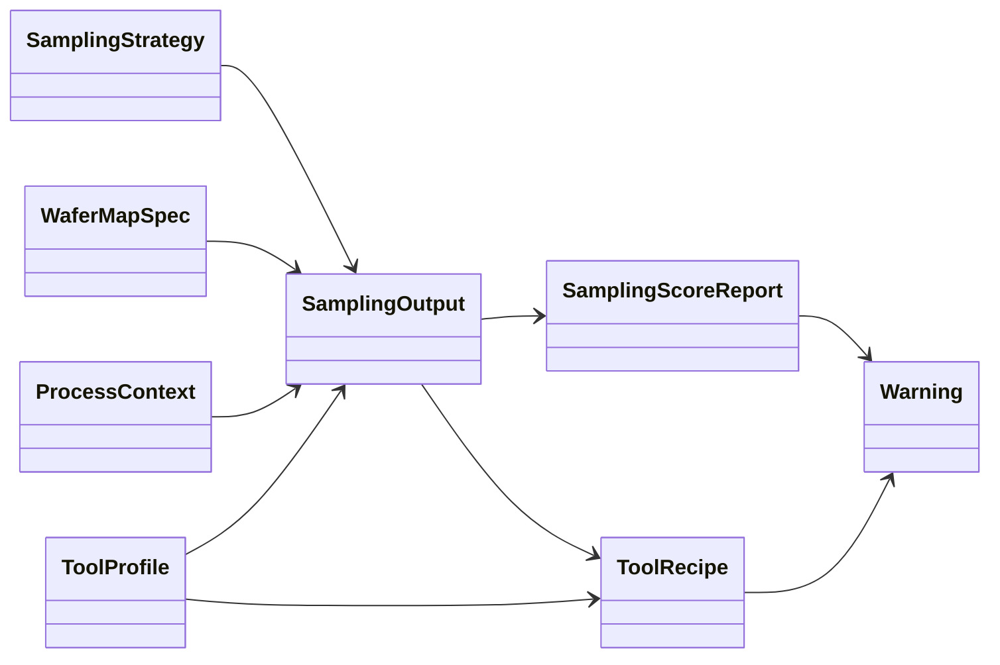

# sampling_architecture_full.md
## Sampling Strategy System – Abstract Architecture (v0)

This document defines the **abstract architecture** for a Sampling Strategy System that generates:
1) **Sampling points** on a wafer map, and
2) **Tool-executable recipes** derived from those points.

It is the baseline for:
- `docs/user_flow.md` (Wizard)
- `docs/frontend_component_spec.md` (Gemini FE)
- `docs/backend_implementation_guide.md` (Claude BE)
- `api/openapi.yaml` (API contract)

---

## 1. Abstracted End-to-End Flow (Overview)

### 1.1 Conceptual Flow
```
Inputs (Context)
  L1 WaferMapSpec  +  L2 ProcessContext  +  L2b ToolProfile
                  |
                  v
Decision
  L3 SamplingStrategy -> SamplingOutput (selected points)
                  |
                  v
Evaluation
  L4 SamplingScoreReport (scores + warnings; no mutation)
                  |
                  v
Translation
  L5 RecipeTranslator -> ToolRecipe (tool-executable payload + notes)
```

### 1.2 Wizard Projection
- Step 1 selects Tech → selects an L1 WaferMapSpec
- Step 2 selects Process Context → resolves L2 ProcessContext
- Step 3 selects Tool Type → resolves L2b ToolProfile
- Step 4 chooses strategy id/params
- Step 5 calls L3 preview + L4 score
- Step 6 calls L5 recipe generation

---

## 2. Layer Model (L1 → L5)

### L1 — WaferMapSpec
**Purpose**
Define the wafer coordinate universe and valid die set.

**Responsibilities**
- Define wafer geometry and die pitch
- Define coordinate system (die grid)
- Define valid die mask (edge exclusion or explicit list)

**Non-responsibilities**
- No process risk logic
- No tool constraints
- No point selection

**Output**
- `WaferMapSpec`

---

### L2 — ProcessContext
**Purpose**
Define manufacturing intent and risk boundary.

**Responsibilities**
- Process step, measurement intent, mode
- Derive criticality
- Define sampling constraints (min/max points)
- Define allowed strategy set

**Non-responsibilities**
- Does not select points
- Does not translate tool recipe

**Output**
- `ProcessContext`

---

### L2b — ToolProfile
**Purpose**
Describe tool execution constraints and accepted coordinate systems.

**Responsibilities**
- Max points per wafer
- Edge die support
- Supported coordinate systems
- Recipe format metadata

**Non-responsibilities**
- Does not select points (but provides constraints)
- Does not score sampling quality

**Output**
- `ToolProfile`

---

### L3 — SamplingStrategy & SamplingOutput
**Purpose**
Select sampling points given context constraints.

**Responsibilities**
- Implement point selection algorithm
- Respect L1 valid die mask
- Respect L2 min/max constraints
- Respect L2b execution constraints (as constraints, not translation)

**Non-responsibilities**
- Does not score adequacy (that's L4)
- Does not translate to tool recipe (that's L5)

**Output**
- `SamplingOutput` (selected points + trace)

---

### L4 — SamplingScoreReport
**Purpose**
Evaluate whether selected points are adequate, representative, and aligned with process risk.

**Responsibilities**
- Quantify spatial coverage
- Quantify statistical sufficiency
- Quantify risk alignment (based on L2 criticality)
- Emit warnings without mutating sampling output

**Non-responsibilities**
- Must not add/remove/reorder points
- Must not change strategy

**Output**
- `SamplingScoreReport`

---

### L5 — RecipeTranslator & ToolRecipe
**Purpose**
Translate sampling points into tool-executable recipe payload.

**Responsibilities**
- Coordinate conversion (die grid → tool coordinates)
- Enforce tool constraints deterministically (truncate/drop with notes when applicable)
- Emit translation notes and warnings
- Produce tool-executable recipe payload

**Non-responsibilities**
- Does not decide points (that's L3)
- Does not score adequacy (that's L4)

**Output**
- `ToolRecipe`

---

## 3. Objects & Schemas (v0)

This chapter formalizes **object-level responsibilities** and **layer ownership**.
It clarifies enforcement boundaries for FE/BE.

### Object Responsibility Table

| Layer | Object | Responsibility |
|---:|---|---|
| L1 | WaferMapSpec | 幾何定義（座標、die pitch、valid mask） |
| L1 | ProcessContext | 製程限制、風險、min/max |
| L2 | ToolProfile | Tool 能力與執行限制 |
| L2 | SamplingStrategy | 演算法類型（不含結果） |
| L3 | SamplingOutput | 抽樣結果（唯一 point selector） |
| L4 | SamplingScoreReport | 評估報告（read-only） |
| L5 | ToolRecipe | 可執行輸出（tool payload） |
| X | Warning | 非阻斷回饋 |

### Object Relationship Diagram



Following sections define the canonical objects used across L1–L5.
(Authoritative schema definitions are in `api/openapi.yaml` components for v0.)

### 3.1 L1 WaferMapSpec
Key fields:
- wafer_size_mm
- die_pitch_x_mm / die_pitch_y_mm
- notch_orientation_deg
- valid_die_mask

### 3.2 L2 ProcessContext
Key fields:
- process_step
- measurement_intent
- mode
- criticality
- min_sampling_points / max_sampling_points
- allowed_strategy_set

### 3.3 L2b ToolProfile
Key fields:
- tool_type / vendor / model
- coordinate_system_supported
- max_points_per_wafer
- edge_die_supported
- recipe_format

### 3.4 L3 SamplingOutput
Key fields:
- sampling_strategy_id
- selected_points[] (die_x, die_y)
- trace (strategy_version, generated_at)

### 3.5 L4 SamplingScoreReport
Key fields:
- coverage_score (0..1)
- statistical_score (0..1)
- risk_alignment_score (0..1)
- overall_score (0..1)
- warnings[]

### 3.6 L5 ToolRecipe
Key fields:
- recipe_id
- tool_type
- recipe_payload (tool-specific JSON)
- translation_notes[]
- recipe_format_version

---

## 4. End-to-End API Execution Flow (v0)

### Step 1–3: Catalog
- FE uses catalog endpoints to build selections:
  - /v1/catalog/techs
  - /v1/catalog/wafer-maps
  - /v1/catalog/process-options
  - /v1/catalog/process-context
  - /v1/catalog/tool-options
  - /v1/catalog/tool-profile

### Step 5: Preview + Score
- POST /v1/sampling/preview  → returns L3 SamplingOutput + warnings
- POST /v1/sampling/score    → returns L4 SamplingScoreReport

### Step 6: Generate Recipe
- POST /v1/recipes/generate  → returns L5 ToolRecipe + warnings

---

## 5. Guardrails & Invariants (Must Not Break)

1. L4 is read-only evaluation: **no mutation** of L3 outputs.
2. L5 is the only place where tool-specific format/coordinates are produced.
3. UI never modifies points; any change requires rerunning L3.
4. Determinism: same inputs produce same outputs (critical for testing).
5. Warnings are non-blocking and returned in 200 bodies; blocking errors use 4xx/5xx.

---

## 6. Prototype Strategy (v0 Reference)

A recommended v0 strategy is `CENTER_EDGE`:
- Always include center point
- Include a deterministic set of inner/outer candidate points
- Filter by valid die mask
- Truncate deterministically to satisfy constraints

Scoring (v0 reference):
- Coverage: rings hit / 3
- Statistical: based on n vs min/max
- Risk alignment: penalize missing outer ring when criticality=HIGH
- Overall: fixed weighted average

---

## 7. Extension Hooks (for v1+)
- Add more strategies under L3 (strategy registry)
- Add more translators under L5 (tool adapter registry)
- Add adaptive sampling loop (still preserving L4 non-mutation; feedback is an explicit v1 flow)

---

## 8. Document Relationships
- Wizard UX: `docs/user_flow.md`
- FE implementation: `docs/frontend_component_spec.md`
- BE implementation: `docs/backend_implementation_guide.md`
- Contract: `api/openapi.yaml`
- Scaffold: `docs/prototype_scaffold.md`
